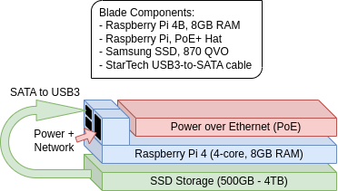

## Overview

Building, deploying, and testing AI Swarms using clusters of Raspberry Pi's (and similar single-board computers).  Local LLM's are here to stay, and there are daily updates to models and architectures that make them even more viable.  The AI Swarm is a flavor of "Mixture of Experts", but it is unique in that the Experts can talk to each other.  Part of this project is to enable quick testing of a variety of LLMs, and part is to build (extend Autogen) the tools that will enable multiple LLM to have parallel and ad-hoc conversations among each other, to solve a problem.  

Being in a very resource-constrained environment will require us to use / build technical hacks that will allow a team of AI to create a large body of collaborative work, without forgetting details or taking too long to complete individual tasks.  

We will also use this project to test other cluster technologies (SLURM) and AI architectures (Federated Learning), as a way to prove specialized models and "edge AI".

## Cluster Components

## Blade Components

## Major steps to build the RasPAI Swarm
1. [Setup you local environment as Kubernetes admin / Docker builder](LOCALENV_SETUP.md)
2. [Build the blades, create a custom Linux image, and install the image on the blades](worker/README.md)
3. [Deploy Kubernetes, install apps on the cluster, and connect your local environment](cluster/README.md)
4. [Build the AI Agent, download models, and deploy several into the cluster](aiagent/README.md)
5. [Build the Swarm Leader, configure the Swarm, and run your first test](aileader/README.md)

## Future enhancements

The Swarm will need several software and strategy changes to make this work on such constrained hardware.  Even today, we are not fully utilizing the hardware that is available, so we can add new capabilities without slowing overall performance.  Software / strategy enchancements :
- [ ] [Switch to LiteLLM](https://litellm.ai/)
- [ ] Ability to switch models, based on request
- [ ] Dynamic context windows
- [ ] Create "ParallelConversation" strategy in Autogen
- [ ] Context window compression
- [ ] Add "Retrieval Augmented Generation" (RAG) to AI Agent
- [ ] Add "TeachableAgent" / MemGPT-type iterative learning

There are several opportunities to upgrade the hardware, and use different cluster technologies / problem solving strategies to better use existing hardware.  These are aspirational, and we will update this repo along the way :
- [Upgrade to RasPi 5](https://www.reddit.com/r/LocalLLaMA/comments/18c2uch/mistral_7b_q4_k_m_on_a_pi_5_in_realtime/)
- [Build for OrangePi w/ GPU](https://blog.mlc.ai/2023/08/09/GPU-Accelerated-LLM-on-Orange-Pi)
- [Switch some cluster nodes to SLURM and MPI](https://www.quantstart.com/articles/building-a-raspberry-pi-cluster-for-qstrader-using-slurm-part-1/)
- [Federated learning and TensorFlow](https://towardsdatascience.com/3-ways-to-install-tensorflow-2-on-raspberry-pi-fe1fa2da9104)
s