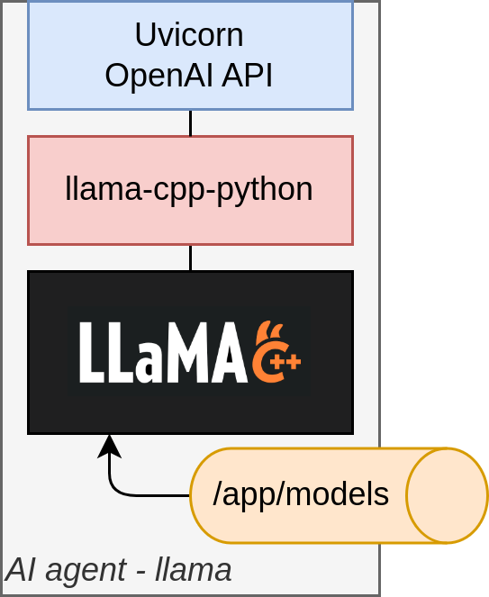

## Overview

We are building a series of Local LLM containers that we can use to run different model architectures.  The first container is focused on the [llama.cpp](https://github.com/ggerganov/llama.cpp) design, as it supports a variety of quantized models that will run on a Raspberry Pi.  Daily, there are new models and techniques being released, and this folder will be a collection of container builds that support running them on a Kubernetes cluster.  All containers will expose an OpenAI API-compliant endpoint, so we should be able to leverage many frontends and libraries for interacting with these AI models, as backends.

The current llama-based container looks like this, internally:


## AI Agent uses the following components
- [x] llama.cpp
- [x] llama-cpp-python
- [ ] *openchat-ui - interactive chat testing*
- [ ] *MemGPT - very long context windows*
- [ ] *ChromaDB - text embeddings for conversations + research*
- [ ] *PostgreSQL - searchable text from conversation + research / document index*
- [ ] *Redis Client - shared conversation store*

## Building AIAgent docker images 

This build is done on an x86 computer using a docker crossbuild.  We will build docker images for both `linux/amd64` and `linux/arm64`.  Because we are using a docker container to do the crossbuild, we will not be able to store the build output in the local `docker images` catalog.  So we need to `--push` the build output to a private docker registry.  This private docker registry should already be installed in Kubernetes using Helm.  See [Cluster README](../cluster/README.md) for any specific details.

1. Login to the private docker registry, deployed in Kubernetes
```
export DR_PASSWORD=$(kubectl get secret -n default docker-registry-secret -o jsonpath="{.data.haSharedSecret}" | base64 -d; echo)
docker login -u admin -p $DR_PASSWORD registry.cc.local
```

2. Build our custom AI Agent docker image (based on llama-cpp-python)
```
cd ./llama-cpp

docker buildx build --platform linux/amd64,linux/arm64 --progress plain -t "registry.cc.local/coincatcher/aiagent-llama:latest" --file "./Dockerfile" . --push

# We also created an image based on GPT4All, but the models are limited until they rebase with the current version of llama-cpp
# cd ./gpt4all
# docker buildx build --platform linux/amd64,linux/arm64 --progress plain -t "registry.cc.local/coincatcher/aiagent-gpt4all:latest" --file "./gpt4all/Dockerfile" . --push

# Building the Local-LLM project succeeds, but it does not support "streaming" responses.
# Local-LLM instructions:
# git clone https://github.com/Josh-XT/Local-LLM.git
# cd Local-LLM
# docker buildx build --platform linux/amd64,linux/arm64 --progress plain -t "registry.cc.local/coincatcher/aiagent-localllm:latest" --file "./Dockerfile" . --push

# Building the LocalAI project succeeds, but it is very slow to build, and we need to modify it significantly to run on RasPi
# LocalAI instructions:
# git clone https://github.com/mudler/LocalAI.git
# cd LocalAI
# >>> MISSING SEVERAL MODIFICATIONS FOR RASPI <<<
# docker buildx build --platform linux/arm64 --progress plain -t "registry.cc.local/coincatcher/aiagent-compute:latest" --file "./Dockerfile" --build-arg="IMAGE_TYPE=core" . --push
```

## Downloading models

We are currently limited to models that can run using the llama.cpp backend, and even then, we are futher limited to the 4-bit quantized versions of those models.  Thankfully, we are seeing daily improvements in LLM and several new Small Language models (SLM).  For our testing, we are currently using the following models :

- [dolphin-2.1-mistral-7b](https://huggingface.co/TheBloke/dolphin-2.1-mistral-7B-GGUF)
- [neural-chat-7b-v3.1](https://huggingface.co/TheBloke/neural-chat-7B-v3-1-GGUF)
- [openchat_3.5](https://huggingface.co/TheBloke/openchat_3.5-GGUF)
- [orca-2-7b](https://huggingface.co/TheBloke/Orca-2-7B-GGUF)

Models that you download will need to be stored on any of the AI Agent hard drives, in a subfolder that identifies the model. The `rsync jobs` that were configured during [Cluster Setup](../cluster/README.md) will take care of replicating the model to all worker nodes that are running AI Agents. For example, the 4-bit quantized version of the `orca-2-7b` model would be stored at the following path:

> /storage/models/orca-2-7b/orca-2-7b-Q4_K_M.gguf

You will also need to download the associated `config.json` and `README.md` files when you download the GGUF model file.

## Deploying AI Agents to the cluster

The `kubernetes` folder contains the configuration we need to deploy 4 AI Agents onto the cluster.  These AI Agents are configured to always deploy to specific nodes on the cluster and they use the local hard-drive for accessing AI models and reading personas / prompts.  Change these configurations as needed.

To deploy these AI Agents, we will execute the following steps:

**1. `aiagent-llama-pv+pvc.yml`** - Use this to create the local data storage for each AI Agent.  This will create that PersistentVolumes and PersistentVolumeClaims used be each of the 4 AI Agents,  on each of their designated worker nodes. You can apply this config using the following:
   > kubectl apply -f aiagent-llama-pv+pvc.yml
   
**2. `aiagent-llama-deploy.yml`** - Use this to create a Deployment spec and a Network service for each AI Agent.  Each AI Agent will bind to their designated worker nodes, by using the `nodeSelector` attribute. Each AI Agent in this file is configured to load a specfic LLM, so you will need to change these before deployment if you are testing different models. You can apply this config using the following:
   > kubectl apply -f aiagent-llama-deploy.yml
   
**3. `aiagent-llama-ingress.yml`** - Use this to create the external network access and URL for each AI Agent. You can apply this config using the following:
   > kubectl apply -f aiagent-llama-ingress.yml