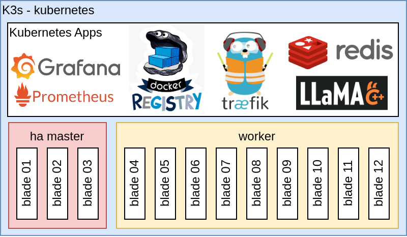
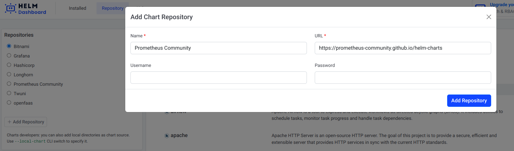
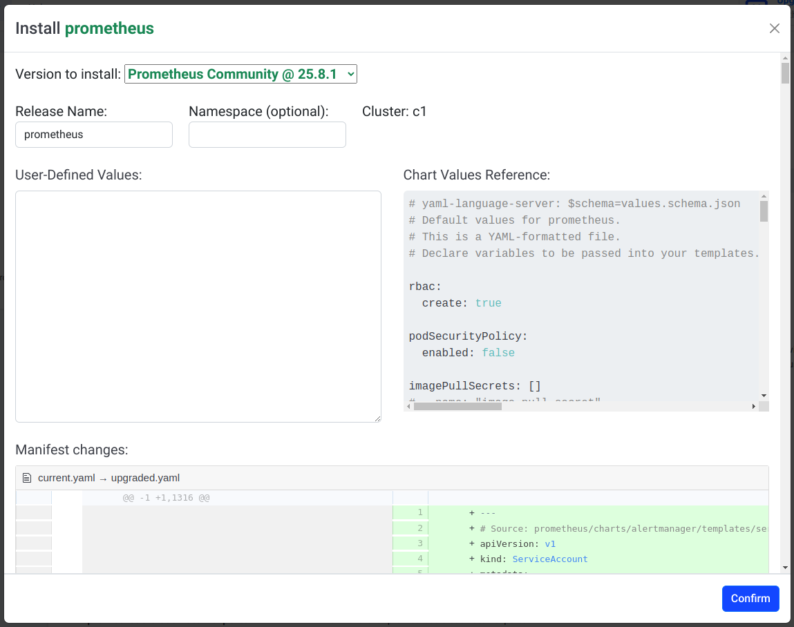
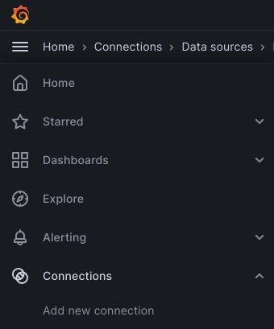
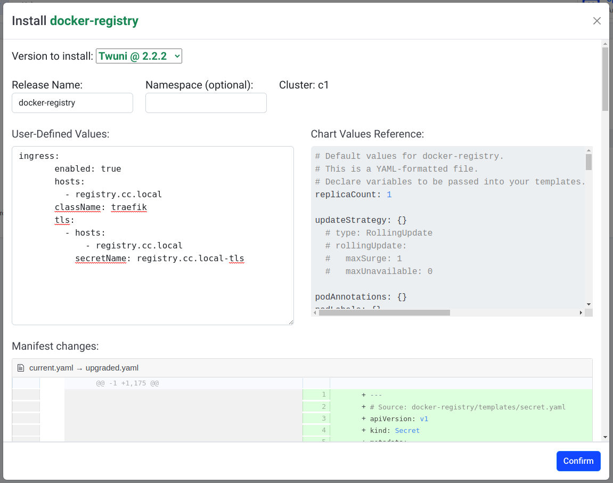

## Overview

Guide for deploying Kubernetes (K3s) on a cluster of Rasberry Pi's.  We include a series of scripts for maintenance and fixing various issues.  This guide will describe how to setup Helm, Tiller, Prometheus, Grafana, and Docker Registry. In the end, we will have a deployment, similar to this diagram:




## Scripts Catalog
Several scripts have been created to manage different tasks for building and maintaining the cluster.  You will need to run these scripts on a computer that has its `kubectl` application already connected to the correct Kubernetes context.  Some of these scripts were created to fix an issue that probably should be fixed when the worker image was created.  Those scripts are marked as **DEPRECATING**, and they should be considered temporary.   The list of current cluster scripts and descriptions follows:

Scripts for managing the cluster lifecycle

- **`cluster-deploy.sh`** - Install Kubernetes on every node.  IP addresses + cluster structure are hard-coded.
  This script contains a fix specific to Ubuntu 22.04, but it is commented out. [It is a fix for vxLAN, required by Flannel](https://github.com/techno-tim/k3s-ansible/pull/50)
- **`cluster-undeploy.sh`** - Uninstall Kubernetes from every node. IP addresses are hard-coded.
- **`cluster-restart.sh`** - Restart the worker nodes for the entire cluster. IP addresses are hard-coded.

Scripts for managing one-time / rare cluster tasks

- **`cluster-labelnodes.sh`** - Give each node a role (label). DNS name for each node is hard-coded.
- **`cluster-setup_dns.sh`** - Setup the DNS names, locally, and on worker nodes. IP + DNS for nodes are hard-coded.
- **`cluster-setup_jobs.sh`** - Setup maintenance tasks for the cluster. Docker Registry is hard-coded.
- **`cluster-installcerts.sh`** - Create a key and cert, then install it locally, on all nodes, and in Kubernetes.

Scripts for small fixes
- **`cluster-fix_memlock.sh` : DEPRECATING** - Fix an issue where Docker cannot acquire a lock on large RAM
- **`cluster-fix_nfs.sh` : DEPRECATING** - Fix a permission issue with how NFS was configured in worker disk images
- **`cluster-no_ssh_password.sh` : DEPRECATING** - Fix an issue with requiring a password every time you use SSH


## Steps for Deploying the Cluster


1. **`cluster-no_ssh_password.sh`** - Run this script with no arguments, to enable SSH connecting to worker nodes, no password.  
   Not required.  Will be fixed in the original worker image, and this step will be removed.
   ==IP addresses for worker nodes are hard-coded in this script to use the `10.0.1.0/24` network.==
   <br/>

2. **`cluster-deploy.sh`** - Run this script with no arguments, to deploy the entire cluster.  
   ==IP addresses for worker nodes are hard-coded in this script to use the `10.0.1.0/24` network.==
   ==Structure of cluster is hard-coded in this script to use 3 HA Master nodes, and 9 Worker nodes.==
   ==Kubernetes context is hard-coded in this script to use the `c1` name.==
   <br/>

3. **`cluster-setup_dns.sh`** - Run this script with no arguments, to add DNS entries locally and on worker nodes.
   ==IP addresses for worker nodes are hard-coded in this script to use the `10.0.1.0/24` network.==
   ==DNS Names for worker nodes are hard-coded in this script==
   <br/>

4. **`cluster-fix_memlock.sh`** - Run this script with no arguments, to allow Docker containers to request a large MEMLOCK.
   This is needed for loading an entire AI model / LLM (4-5GB) into RAM and locking it there.
   Not required.  Will be fixed in the original worker image, and this step will be removed.
   ==Only 4 worker nodes getting this fix are hard-coded in this script==
   <br/>

5. **`cluster-fix_nfs.sh`** - Run this script with no arguments, to fix permissions on the worker node NFS exports.
   Not required.  Will be fixed in the original worker image, and this step will be removed.
   ==DNS Names for worker nodes are hard-coded in this script==
   <br/>

6. **`cluster-labelnodes.sh`** - Run this script with no arguments, to apply Kubernetes labels to all worker nodes.
   ==DNS Names for worker nodes are hard-coded in this script==
   ==Roles (labels) for worker nodes are hard-coded in this script==
   <br/>

7. **Install Tiller and Helm Dashboard** - Tiller and Helm will allow us to install Kubernetes apps as packages.
   We should already have Helm CLI installed (when we setup our [local environment](../LOCALENV_SETUP.md)), so we can install the Helm Dashboard plugin by running:
   <br/>
    
    > helm plugin install https://github.com/komodorio/helm-dashboard.git

   To use Helm with Kubernetes, we need to install Tiller.  We can do this by telling the Helm CLI to `init` a local Helm environment, and install Tiller in Kubernetes.  Doing this will require a minor hack for K3s and `arm64`, using the following commands:
   <br/>

    ```
    # Create a "tiller" serivce account and assign permissions
    kubectl -n kube-system create serviceaccount tiller
    kubectl create clusterrolebinding tiller   --clusterrole=cluster-admin   --serviceaccount=kube-system:tiller

    # Initialize the local Helm environment, and also hack the Tiller deploy to work on K3s and arm64
    helm init --service-account tiller --override spec.selector.matchLabels.'name'='tiller',spec.selector.matchLabels.'app'='helm' --output yaml | sed 's@apiVersion: extensions/v1beta1@apiVersion: apps/v1@' | sed 's@gcr.io/kubernetes-helm/tiller:v2.11.0@jessestuart/tiller:v2.9.0@' | kubectl apply -f -
    ```

    Now that we have Helm Dashboard and Tiller installed in Kubernetes, you can start the Helm Dashboard by running:
    <br/>

    > helm dashboard

    <br/>

8. **Install Prometheus and Grafana (using Helm Dashboard)** - Use the Helm Dashboard to manage Prometheus and Grafana apps.
    The Helm Dashboard should be open in a web browser (after you run `helm dashboard`) and it will take you to 
    http://localhost:8080/#context===c1==, where ==c1== is the Kubernete context you created during the `deploy` step above.  
    We want to add the following URLs to the `Repository` section of Helm Dashboard (click `+ Add Repository`):
    <br/>

    - Prometheus Community : https://prometheus-community.github.io/helm-charts
    - Grafana : https://grafana.github.io/helm-charts

    
    After these Repositories are added, click on the `Prometheus Community` repo and click the `prometheus` chart.
    This will show the `Install prometheus` dialog.  We are not making any modifications, so click `Confirm`

    
    <br/>

    Repeat these steps with the `Grafana` repo, and install the `grafana` chart.

    ##### Getting a URL for Prometheus and Grafana

    If you would like to connect to the `Prometheus` and `Grafana` pods directly, we can create some `NodePort` services that will give us a direct connection to these pods.  This is not optimal (prefer an `Ingress`), but is a workable solution.  To add some `NodePorts` run:
    > kubectl expose service prometheus-server --type=NodePort --target-port=9090 --name=prometheus-server-ext
    > kubectl expose service grafana --type=NodePort --target-port=3000 --name=grafana-ext

    To use these `NodePort` services so you can load the UI in a webbrowser, you need to determine the `Node`, and more specifically, the `Node IP` and `Node Port` that each `Pod` is running on.  You can find the ==Prometheus URL== by running:
    ```
    export NODE_NAME=$(kubectl get pod -o wide | grep prometheus-server | grep -Eo 'c01w[[:digit:]]{2}')
    export NODE_PORT=$(kubectl get svc | grep prometheus-server-ext | grep -Eo '3[[:digit:]]{4}')
    export NODE_IP=$(kubectl get node -o wide | grep $NODE_NAME | grep -Eo '([[:digit:]]{1,3}\.){3}[[:digit:]]{1,3}')
    echo "http://${NODE_IP}:${NODE_PORT}"
    ```

    Similarly, you can find the ==Grafana URL== by running:
    ```
    export NODE_NAME=$(kubectl get pod -o wide | grep grafana | grep -Eo 'c01w[[:digit:]]{2}')
    export NODE_PORT=$(kubectl get svc | grep grafana-ext | grep -Eo '3[[:digit:]]{4}')
    export NODE_IP=$(kubectl get node -o wide | grep $NODE_NAME | grep -Eo '([[:digit:]]{1,3}\.){3}[[:digit:]]{1,3}')
    echo "http://${NODE_IP}:${NODE_PORT}"
    ```
    ==NOTE==: we used a Node naming pattern of `c01w`==XX==, where ==XX== is the Worker number. This naming pattern is embedded in the first command above, so if you name your nodes differently, you will need to adjust the commands above.

    ==NOTE==: We will replace this `NodePort` solution with an `Ingress` solution, in the future.

    ##### Connecting Grafana to Prometheus

    We need to connect `Grafana` to the `Prometheus Server`, and to do this, we need to load the Grafana web UI.  Use the steps above to determine the URL for the Grafana web UI, and load it in a web browser.  The Grafana web UI will present you with a login screen.  
    ==The username is `admin`==
    To find the password, you will need to run the following command:
    > kubectl get secret -n default grafana -o jsonpath="{.data.admin-password}" | base64 -d; echo

    Once you are logged in, click the Menu Icon in the top-left, and under Connections, click ==Add new connection==.
    

    A catalog of connection options will appear.  Search for `Prometheus`, and click that option when it appears.  A summary for the `Prometheus` connection will display.  Click ==Add new data source== in the top-right corner.  We only need to fill in the ==Prometheus server URL== field on this form, and we can get this value by running the following command:
    > kubectl get svc | grep 'prometheus-server\ ' | grep -Eo '([[:digit:]]{1,3}\.){3}[[:digit:]]{1,3}'

    Make sure to include ==http://== before the IP address, from the above command. Scroll to the bottom and click ==Save & Test==. 
    <br/>

    Now that `Grafana` and `Prometheus` are connected, you can add some `Dashboards` and start monitoring the Cluster!
    <br/>

9.  **`cluster-installcerts.sh`** - Run this script with no arguments, to create a TLS key + cert for `registry.cc.local`, and to register it on all worker nodes and in Kubernetes. This is a self-signed certificate, so we will need to take steps (later) to get components to accept this cert as valid.  All keys and cert material is assembled locally in a `certs` subfolder.
   ==IP address for `registry.cc.local` is hard-coded in this script to use the `10.0.1.10`.==
   ==DNS Names for worker nodes are hard-coded in this script==
   <br/>

10. **Install Docker Registry (using Helm Dashboard)** - Use the Helm Dashboard to manage the Docker Registry app.
    The Helm Dashboard should be open in a web browser (from previous steps). We want to add the following URL to the `Repository` section of Helm Dashboard (click `+ Add Repository`):
    <br/>

    - Twuni : https://helm.twun.io
    <br/>

    After this Repository is added, click on the `Twuni` repo and click the `docker-registry` chart.
    This will show the `Install docker-registry` dialog. We want to customize this deployment so the Docker Registry knows how to use the keys and certificates we created in the previous step.  In the `User-Defined Values` box, add the following:

    ```
    ingress:
       enabled: true
       hosts: 
         - registry.cc.local
       className: traefik
       tls:
         - hosts:
             - registry.cc.local
           secretName: registry.cc.local-tls
    ```

    
    Click ==Confirm== and allow the installation in Kubernetes to complete.

    ##### Connecting your local Docker to the Docker Registry
    We need to tell our local Docker setup to allow us to connect to an insecure Docker Registry.  The certificate we created is 'self-signed' so Docker will throw errors when we try to use it.  To allow insecure registries, run the following commands:
    ```
    echo '{ "insecure-registries" : ["registry.cc.local", "10.0.1.10:443"] }' | sudo tee /etc/docker/daemon.json
    sudo systemctl daemon-reload
    sudo systemctl restart docker
    ```

    Now our local Docker will allow us to communicate with the Docker Registry.  We can `login` to the Docker Registry to prove this is working by running the following commands:
    ```
    export DR_PASSWORD=$(kubectl get secret -n default docker-registry-secret -o jsonpath="{.data.haSharedSecret}" | base64 -d; echo)
    docker login -u admin -p $DR_PASSWORD registry.cc.local
    ```

11. **`cluster-setup_jobs.sh`** - This script will schedule some jobs in Kubernetes, and can optionally build a special `lifeboat` Docker image that we can use for jobs and general maintenance.  The first time you run this script, you will want to build a `lifeboat`, because the Kubernetes jobs need it.  Building a `lifeboat` will require you to be connected to the Docker Registry (previous step, when we `login`).  To build a `lifeboat` and schedule Kubernetes jobs, run the following command:
    > ./cluster-setup_jobs.sh buildLifeboat

   <br/>


## Notes, links, and useful commands

#### Links
- [Kubernetes on Raspberry Pi, by Alex Ellis, the creator of K3sup](https://blog.alexellis.io/test-drive-k3s-on-raspberry-pi/)
- [Kubernetes on Raspberry Pi, by Carl Paton](https://carlpaton.github.io/2020/09/raspberry-pi-cluster-kubernetes/)

#### Commands
- Watching a K3S worker node running
  > sudo journalctl -fu k3s-agent.service
- Remove an HA Master Node, before re-adding it to the cluster (repair damaged master node)
  1. Deploy a special maintenance pod for etcd, and attach to this pod at the command line
    > kubectl run --rm --tty --stdin --image docker.io/rancher/coreos-etcd:v3.4.13-arm64 etcdctl --overrides='{"apiVersion":"v1","kind":"Pod","spec":{"hostNetwork":true,"restartPolicy":"Never","securityContext":{"runAsUser":0,"runAsGroup":0},"containers":[{"command":["/bin/sh"],"image":"docker.io/rancher/coreos-etcd:v3.4.13-arm64","name":"etcdctl","stdin":true,"stdinOnce":true,"tty":true,"volumeMounts":[{"mountPath":"/var/lib/rancher","name":"var-lib-rancher"}]}],"volumes":[{"name":"var-lib-rancher","hostPath":{"path":"/var/lib/rancher","type":"Directory"}}],"nodeSelector":{"node-role.kubernetes.io/etcd":"true"}}}'
  2. Get a list of etcd members currently
    > etcdctl --key /var/lib/rancher/k3s/server/tls/etcd/client.key --cert /var/lib/rancher/k3s/server/tls/etcd/client.crt --cacert /var/lib/rancher/k3s/server/tls/etcd/server-ca.crt member list
  3. Remove the damaged cluster member (replace ==be5de06ab999a734== with correct member id)
    > etcdctl --key /var/lib/rancher/k3s/server/tls/etcd/client.key --cert /var/lib/rancher/k3s/server/tls/etcd/client.crt --cacert /var/lib/rancher/k3s/server/tls/etcd/server-ca.crt member remove ==be5de06ab999a734==
- Scale a Kubernetes deployment down to ZERO (replace ==aiagent01== with correct deploy name)
  > kubectl scale --replicas=0 deployment ==aiagent01==
- Remove all workloads from a Worker Node (replace ==c01w12== with correct node name)
  > kubectl cordon ==c01w12==
  > kubectl drain ==c01w12==  --grace-period=300 --ignore-daemonsets=true --force
- Allow workloads to be added back to a Worker Node (replace ==c01w12== with correct node name)
  > kubectl uncordon ==c01w12==
