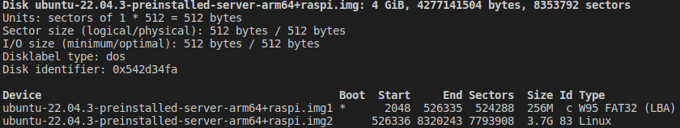
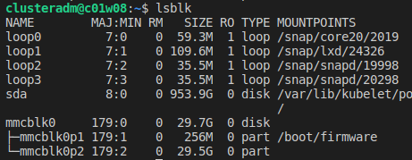
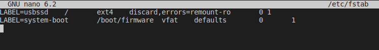
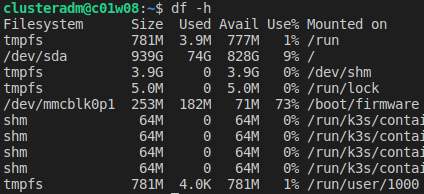

## Overview

We are going to create a custom Ubuntu 'disk image' that we can copy directly to a microSD card.  This will allow us to rapidly build multiple Workers for our Cluster.  Each time we copy this disk image to a microSD card, we will customize the image for the specific Worker we are creating, to include a unique IP Address, DNS routes and Hostname.

Refer to this guide for a more complete explanation of the steps involved with creating a custom Ubuntu image for Raspberry Pi
- https://opensource.com/article/20/5/disk-image-raspberry-pi


## Create an SSH keypair to be used when connecting to the Cluster
We are going to create an SSH keypair locally (not in the main keystore) that we will copy into the custom Ubuntu image we are building.  We will also add it to the keystore, but we want it separate for now so we can easily copy it when we need.  To create the keypair run the following command (==do not add a passphrase, just hit Enter==):
> ssh-keygen -b 4096 -t rsa -f cluster-ssh-keys

You should see 2 new files: `cluster-ssh-keys` and `cluster-ssh-keys.pub`.  To add the SSH private key to your keystore, run the following:
> ssh-add ./cluster-ssh-keys

## Steps for creating a custom Ubuntu 'disk image' for RasPi

**1. Download an existing Ubunut disk image (we use Ubuntu 22.04)**
> wget https://cdimage.ubuntu.com/releases/jammy/release/ubuntu-22.04.3-preinstalled-server-arm64+raspi.img.xz

**2. Decompress the RasPi image file**
> xz --decompress ubuntu-22.04.3-preinstalled-server-arm64+raspi.img.xz

**3. Find the `MOUNT_OFFSET` (in bytes) for the 'root' partition**
    Formula to find `MOUNT_OFFSET` = `Start sector` * `Sector size`
    For example, if `Start sector` = 526336, and `Sector size` = 512, then `MOUNT_OFFSET` = 269484032
    Use the `fdisk -l IMAGE_FILE` command to determine the `Start sector` and `Sector size`
    <br/>
    Example output from running `fdisk -l ubuntu-22.04.3-preinstalled-server-arm64+raspi.img`
    
    In this example, you can see `Sector size` on the 3rd line, and you can see the `Start sector` on the last line
    For the next step, we used `MOUNT_OFFSET` = 269484032
    <br/>

**4. Mount the Raspberry Pi image file**
   The syntax for mounting an images as a "loop" device looks like this:
   `sudo mount -o loop,offset=MOUNT_OFFSET IMAGE_FILE MOUNT_FOLDER`
   We will use the `MOUNT_OFFSET` and `IMAGE_FILE` from before, and will use `./root` as our `MOUNT_FOLDER`
   After the image is mounted, you can verify it is visible by running `ls -la ./root`
   Mount command we used : 
> sudo mount -o loop,offset=269484032 ubuntu-22.04.3-preinstalled-server-arm64+raspi.img ./root

**5. Install 'ARM64 virtualization' packages**
> sudo apt install qemu-user qemu-user-static

**6. Restart the virtualization capability**
> sudo systemctl restart systemd-binfmt.service

**7. Test switching the terminal to use the mounted root folder as the root for the current 'session'**
   We want to start updating this mounted Ubuntu image, as if it is actually running.  To do this, we are going to 'change root' devices to point to this mounted Ubuntu image.  This did not work correctly when the main computer was Ubuntu 18.04, so we are just trying to test things out first.  To test, run the following command:
> sudo chroot ./root /usr/bin/uname -a -r

==NOTE: for Ubuntu 18.04, they broke alt binary format support, so we must force support for AArch64 Emulated devices==
To "fix" Ubuntu 18.04 (this does not work very well), run the following command:
> sudo cp /usr/bin/qemu-aarch64-static ./root/usr/bin

Make sure the test works before we proceed to the next step

**8. Actually switch the terminal to use the mounted root folder as the root for the current 'session'**
   We will need to copy the SSH public key "into" the mounted image, before we change root.  We are doing this so we can put the SSH public key where we need it later.  We will delete this file from the image when we are done, but for now, to copy the file, use this command:
> sudo cp ./cluster-ssh-keys.pub ./root

Now we can run the change root command:
> sudo chroot ./root /bin/bash

**9. Hard-code some URLs to /etc/hosts, since these lookups will not work inside CHRoot**
> echo "185.125.190.39 ports.ubuntu.com" | sudo tee -a /etc/hosts

**10. Install the SSH key for root user**
    The root user login is disabled in Ubuntu by default, so this is just for "completeness".  You will need to use the SSH key you created earlier (`cluster-ssh-keys`). Run the following commands to add keys to the image for root:
```
mkdir /root/.ssh
cat /cluster-ssh-keys.pub  >> /root/.ssh/authorized_keys
chmod 700 /root/.ssh
chmod 600 /root/.ssh/authorized_keys
```

**11. Create 'clusteradm' user, as the main user account**
```
groupadd clusteradm
useradd -g clusteradm -G users -m -u 1000 clusteradm -s /bin/bash
passwd clusteradm 
# SET THE PASSWORD TO 'password'

mkdir -p /home/clusteradm/.ssh
cat /cluster-ssh-keys.pub >> /home/clusteradm/.ssh/authorized_keys
chmod 700 /home/clusteradm/.ssh
chmod 600 /home/clusteradm/.ssh/authorized_keys
```

**12. Enable 'password-less sudo' for clusteradm**
```
touch /etc/sudoers.d/clusteradm-user
echo "clusteradm ALL=(ALL) NOPASSWD:ALL" | sudo tee -a /etc/sudoers.d/clusteradm-user
```
  
**13. Install NFS and export the external storage mount**
```
sudo apt install net-tools nfs-kernel-server -y
mkdir /storage
chown 1000:1000 /storage
echo "/storage  *(rw,sync,no_subtree_check,anonuid=1000,anongid=1000)" | sudo tee -a /etc/exports
```

**14. SPECIAL INSTRUCTIONS FOR UBUNTU 22.04 (fix for vxLAN required by Flannel)**
    When we are setting up Kubernetes, Flannel will fail to register the workers with the master nodes due to a known issue / missing dependency.  This is specific to Ubuntu 22.04 based workers. [To fix this issue](https://github.com/techno-tim/k3s-ansible/pull/50), run the following command:
> sudo apt install -y linux-modules-extra-raspi

**15.  Cleanup, Unmount the image, and recreate the XZ compressed file**
```
rm /cluster-ssh-keys.pub
exit
sudo umount ./root
xz --compress ubuntu-22.04.3-preinstalled-server-arm64+raspi.img --keep
```

## Install our custom RasPi image on microSD cards
We have a `setup.sh` script that will be used to 'etch' our custom RasPi image onto a microSD card, as well as do any post-install customization.  We only modified the `root` partition in the previous steps, but there is a second `boot` partition that we will modify during this step.  This step will accomplish the following tasks:
- Assign a Hostname to this worker
- Assign an IP address to this worker
- Configure DNS routes (hard-coded in the `setup.sh` script)
- Turn on virtualization (required for Kubernetes)
- Turn off WiFi
- Turn off Bluetooth
- (optional) erase and re-write the microSD card

To use this `setup.sh` script, use the following format:
> ./setup.sh HOSTNAME IPADDRESS [writeSD?]

To etch the microSD card, and do all the post-install setup, your command would look like this:
> ./setup.sh blade08 10.0.0.17 writeSD

If you only want to update configs (not re-etch the microSD), then do not add the final `writeSD` argument.
> ./setup.sh blade02 10.0.0.11

## Moving the `root` partition to the SSD
The microSD card you used is flimsy and not reliable.  You will find that these cards will fail after significant read-write workloads.  And they are generally just slower to use than an SSD over USB3.  We will drastically improve our system by moving the `root` partition over to the SSD.

To do this, we need to put the microSD into the RasPi, and boot it onto the network.  You have the IP Address you installed on the microSD in the previous step, so when the RasPi boots, it will be available at that address.  You can SSH to this device (after a few minutes), using an SSH command like:  `ssh clusteradm@10.0.0.17`

Make sure you are on the same network, or you have a network route that allows you to ping the RasPi.  If you cannot see the device on the network, you may need to connect a monitor / keyboard / mouse to see what address it is using.

If you have successfully SSH'd into the RasPi, then you can start moving the `root` partition over to the SSD.  We assume you have connected an SSD drive using a SATA-to-USB3 cable, and the device is available at `/dev/sda`

To move the `root` partition to the SSD, use the following steps:

**1. Make sure the USB device is not mounted**
If the USB device is mounted, it is likely located at `/dev/sda1`.  No matter what location it is at, we want to make sure there are no mounted devices using `/dev/sda` or `/dev/sdb`.  To check, run the mount command:
> mount

The output of this command shows all current devices that are mounted.  Make sure you do not see `sda` or `sdb`.  If either is present, you need to unmount it using `umount`.  Note the device path that is mounted (e.g. `/dev/sda1`) and run the following command to unmount it:
> sudo umount /dev/sda1

We want to make sure we know what devices are available (mounted and unmounted ones). To do this, run the following:
> lsblk

Example output from a RasPi that has already moved its `root` partition:


The `mmcblk0` devices are for the microSD card, and `sda` is for the USB SSD.  Review your result from running `lsblk` and adjust the remaining instructions accordingly. 

**2. Erase the USB SSD and repartition it**
To erase the USB SSD, we will use the `fdisk` tool.  Some commands you need to know about while you are inside `fdisk`
- Press "p" to show current partitions.  Use this if you are unsure if all the partitions have been deleted
- Press "d" to delete a partition.  We are deleting all partitions, so press "d" until there are no partitions left
- Press "n" to create a new partition.  After all are deleted, we want to create 1 partition that takes the whole disk
- Press "w" to save your changes and exit `fdisk`

To begin this step, run the following command:
> sudo fdisk /dev/sda

Now that the disk has been erased (we deleted all partitions and overwrote the disk with 1 large partition), we need to format the disk.  We will be using the `ext4` format, and we can start this with the following command:
> sudo mkfs.ext4 /dev/sda

**3. Copy the `root` partition from the microSD over to the USB SSD**
This step could take a while (30 mins?), because microSD cards are slow and we are moving several gigabytes of data. To copy the data, run the following:
> sudo dd if=/dev/mmcblk0p2 of=/dev/sda bs=1M status=progress

**4. Mark the USB SSD with a device label**
We use labels on devices so the RasPi can find them more easily during bootup.  To add a label, run the following:
> sudo e2label /dev/sda "usbssd"

**5. Edit the Filesystem Table `fstab`**
By default, the `root` partition wants to use a device that has been marked with `LABEL=writeable`, which is the current `root` partition on the microSD.   We want to tell the system to look for a different device that is marked with `LABEL=usbssd`.  To do this, open the `fstab` file using Nano.  

> sudo nano /etc/fstab

After you switch the device to use for `root`, your `/etc/fstab` should look like this


==To save your changes in Nano, press `Ctrl+o`, and to exit Nano, press `Ctrl+x`==

**6. Modify the system boot command**
We want to give the RasPi a hint about the default `root` device to use during bootup.  We will use Nano again, and we are changing the text that indicates `LABEL=writeable` to say `LABEL=usbssd`.  To make this edit, run the following:
> sudo nano /boot/firmware/cmdline.txt

**7. Restart the RasPi and verify that the microSD `root` is not being used anymore**
We are done with making changes, so we can restart the RasPi with the following command:
> sudo shutdown -r now

After a few minutes, the RasPi will appear on the network again, and you can SSH into it.  To verify that the correct devices were mounted for `root`, we will use the `df` command.  Make sure that `/dev/mmcblk0p2` is not shown when you run the following command:

> df -h

Example result from running `df -h`



## EXPERIMENTAL: Adding a swap partition
This is not required, and it is generally not advised, especially if the worker will be running AI models / LLM.  You want AI / LLM's to be fully loaded into RAM, and if you have a swap partition, then the system will start 'paging' the model out to swap.  This will kill your performance.

There are non-AI / LLM situations, where having a swap partition is useful, so these instructions are included for those scenarios.

Use the following steps to create a swap partition:
```
sudo fallocate -l 8G /storage/swapfile

# if fallocate is missing
sudo dd if=/dev/zero of=/storage/swapfile bs=1024 count=8388608

sudo chmod 600 /storage/swapfile
sudo mkswap /storage/swapfile
sudo swapon /storage/swapfile
echo "/storage/swapfile swap swap defaults 0 0" | sudo tee -a /etc/fstab
sudo swapon --show
```